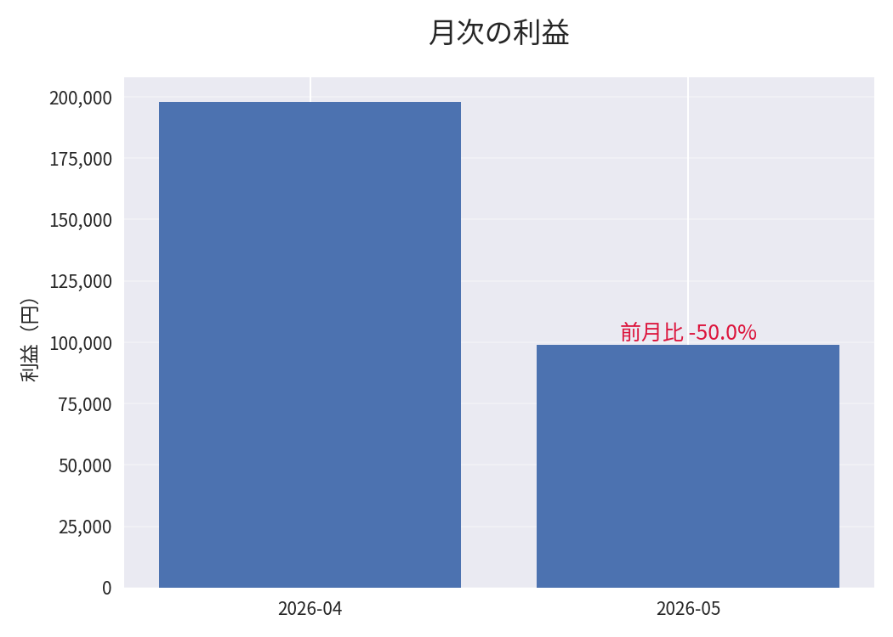

# freee収支レポート自動生成ツール｜AIに数字を「任せきらない」設計

> freeeの取引CSVから、**月次の収入・支出・利益と前月比を「1枚のレポート」に自動でまとめる**Pythonツールです。
> 集計（数字）はコードが担当し、解釈（言葉）だけをAIに書かせる——その役割分担を実装で徹底しています。

<!-- 要確認: リポジトリ名 freee-ai-report-portfolio / GitHub: VCT2000 -->

---

## 📊 これは何か

会計ソフト freee から出力した取引CSVを読み込み、pandas で月ごとに集計し、matplotlib で**そのまま資料に貼れる品質のグラフ**を出力します。最後に、計算済みの数字を見たうえでAIが短い診断コメントを1行添えます。

- **入力**：freeeの取引明細CSV（日付・収支区分・金額）
- **処理**：月次で収入／支出／利益を集計 → 前月比を算出 → グラフ化
- **出力**：利益＋前月比グラフ1枚（`outputs/profit_chart.png`）＋AI診断コメント1行
- **対象**：個人事業主・小規模事業者・士業事務所

---

## 🖼 サンプル出力



<!-- 要確認: outputs/profit_chart.png が最新の出力になっているか（必要なら python src/freee_report_v4.py で再生成） -->

生の取引CSVが、月次の利益推移と前月比が一目で分かる1枚に変わります。

---

## 🔧 なぜ v1 から v4 まであるのか — AIの事故を2回潰した記録

このツールの中心は機能の多さではなく、**AIに数字を扱わせたときに起きた2つの事故を、自力で見つけて構造で解決した過程**です。バージョンはその記録そのものです。

| 版 | やること | 解決した課題 |
|---|---|---|
| **v1** | CSV → 月次集計 → 棒グラフ | まず「数字を正しく集計して描く」基礎を確立 |
| **v2** | ＋ AIによる診断コメント | AIに解釈を書かせたら**桁ミスが発生**（後述・事故①） |
| **v3** | **数字はコード・言葉はAI** に分離 | 金額・前月比はPythonで確定し、AIには計算させない構造へ |
| **v4** | **言い過ぎ防止** | データにない原因をAIが創作する問題を抑止（後述・事故②） |

<!-- 要確認: 各版の差分の表現が実装と一致しているか軽く目視 -->

### 事故①：AIが28万円を「280万円」と書いた（v2で検知）

ある月の収入は28万円。ところがAIのコメントは「280万円」——きっちり10倍。怖いのは、**隣の前月比パーセントは正しかった**ことです。割合は合っているのに金額だけ10倍。だからパッと見では気づきにくい。

→ **v3 の対策**：金額・前月比などの数値は**すべてPythonで計算して確定**し、AIにはその確定値を渡すだけにしました。AIに数字そのものを生成させない設計です。

### 事故②：AIがデータにない理由を書いた（v4で抑止）

AIが「利益の落ち込みは顧客の減少が一因」と書いてきました。もっともらしい。しかし渡したデータは日付と金額だけで、顧客数は含まれていません。AIが“それっぽい原因”を創作した、典型的なハルシネーションです。

 → **v4 の対策**：最初は「読み取れないことは推測するな」と**禁止を列挙**しましたが、それでも「固定費」という渡していない要素をAIが持ち出しました。禁止の列挙は抜け道が残ると気づき、**「言及してよいのは渡した数値（売上・利益・前月比）とその変化だけ」という許可リスト方式**に切り替え。さらに要因に触れたくなったときは「この数字だけでは要因までは判断できません」という定型文だけを許すことで、AIの役割を「確定済みの数字を言葉に翻訳するだけ」に限定しました。

---

## 🧭 設計思想：数字はコード、言葉はAI、最終確認は人間

このツールが守っている原則は1つです。

- **計算（金額・前月比）はプログラムにやらせる。** AIには数字を直接いじらせない。
- **AIに任せるのは、確定した数字を見たあとの「言葉」だけ。** データにない原因は書かせない。
- **金額・単位・前月比・最終判断は、人間が確認する。**

AIを「信じる／信じない」ではなく、**任せるところと自分が握るところを分ける**。技術的には、Pythonで計算した事実（facts）をAIに渡し、AIには解釈の生成だけを担わせる構成で実現しています。

---

## 🚀 使い方

### 1. 依存パッケージのインストール

```bash
pip install -r requirements.txt
```

### 2. APIキーの設定（あなた自身のキーを使います）

AI診断コメント（v2〜v4）は Anthropic API を利用します。**キーはこのリポジトリには含まれていません。** 各自で環境変数 `ANTHROPIC_API_KEY` を設定してください（`.env` ファイルでの管理を推奨。`.env` は `.gitignore` で除外済み）。

```bash
# .env の例（このファイルは公開されません）
ANTHROPIC_API_KEY=sk-ant-...
```

<!-- 要確認: AIモデル名（roadmapでは claude-haiku-4-5）と、.envの読み込み方法が実装と一致しているか -->

### 3. 実行

```bash
# 最新版（言い過ぎ防止まで実装）
python src/freee_report_v4.py
```

<!-- 要確認: 実行コマンド・入力CSVの指定方法（引数 or コード内パス）が実装と一致しているか -->

> v1 は API キー不要（グラフ生成のみ）。v2 以降は API キーが必要です。

---

## 🗂 ファイル構成

```
freee-ai-report-portfolio/
├── data/
│   └── freee_sample.csv        # 練習用の取引データ（架空・実帳簿ではありません）
├── src/
│   ├── freee_report_v1.py      # CSV→月次集計→棒グラフ
│   ├── freee_report_v2.py      # ＋AI診断コメント（事故①を検知した版）
│   ├── freee_report_v3.py      # 数字はコード・言葉はAI に分離
│   └── freee_report_v4.py      # データにない原因を推測させない（最新）
├── outputs/
│   └── profit_chart.png        # 出力サンプル
├── requirements.txt
└── .gitignore                  # .env / venv / __pycache__ を除外
```

---

## 🛠 技術スタック

| 領域 | 使用技術 |
|---|---|
| 言語 | Python 3.13 |
| データ処理 | pandas（`dt.to_period("M")` / `unstack` / `pct_change()`） |
| 可視化 | matplotlib |
| AI | Anthropic API（計算済みの事実を渡し、解釈のみを生成させる設計） |

<!-- 要確認: 技術スタックの記載が実装と一致しているか -->

---

## 📝 関連記事（note）

このツールを作る過程で起きた「AIの2つの事故」と、そこから得た設計原則を記事にしています。

- note：**AIが28万円を「280万円」と書いた日** 〔URL差し替え〕

<!-- 要確認: note3公開後にURLを貼る -->

---

## 👤 作者

紙とハンコの現場で27年働いたのち、AIを相棒に独立を準備している50代エンジニアです。「出てきた数値をそのまま信じない」という現場の確認の癖を、AI時代の設計に持ち込んでいます。

- GitHub: [VCT2000](https://github.com/VCT2000)

<!-- 要確認: プロフィール文がnote・各種プロフィールと整合しているか -->
