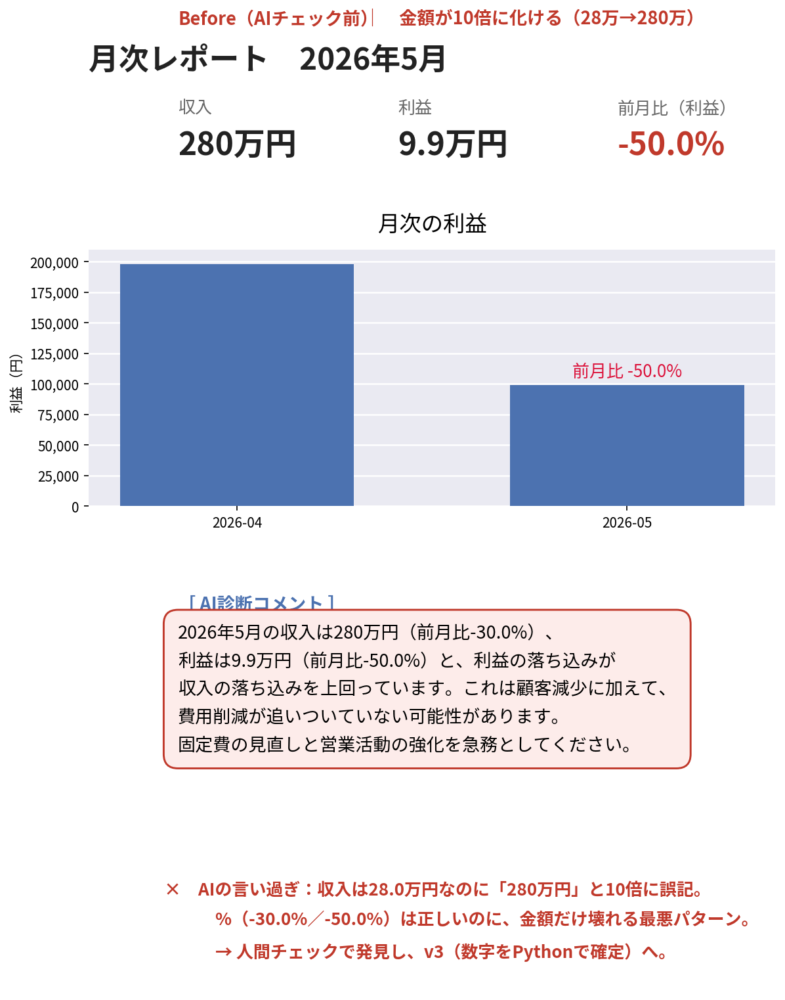
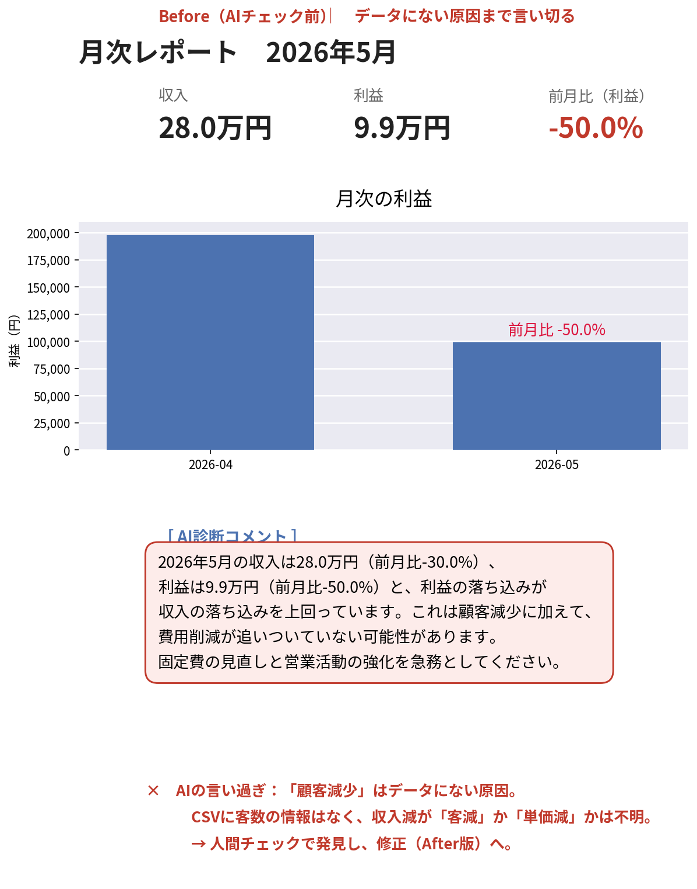
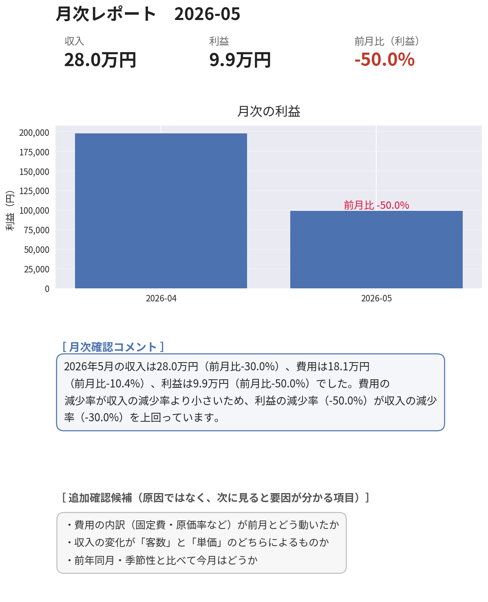

# freee収支レポート自動生成ツール｜AIに数字を「任せきらない」設計

> freeeの取引CSVから、**月次の収入・支出・利益と前月比を「1枚のレポート」に自動でまとめる**Pythonツールです。
> 集計（数字）はコードが担当し、解釈（言葉）だけをAIに書かせる——その役割分担を実装で徹底しています。

---

## 📊 これは何か

会計ソフト freee から出力した取引CSVを読み込み、pandas で月ごとに集計し、matplotlib で**そのまま資料に貼れる品質のグラフ**を出力します。最後に、計算済みの数字を見たうえでAIが短い確認コメントを添えます。

- **入力**：freeeの取引明細CSV（日付・収支区分・金額）
- **処理**：月次で収入／費用／利益を集計 → 前月比を算出 → グラフ化
- **出力**：KPI＋利益推移グラフ＋確認コメント＋追加確認候補を**1枚のカード**に（`freee_report_v4.png`）
- **対象**：個人事業主・小規模事業者・士業事務所

---

## 🖼 このリポジトリの見どころ — AIの事故を見つけて直すまで

このツールの価値は機能の多さではなく、**AIに数字を扱わせたときに起きた事故を、自力で見つけて構造で解決した過程**です。同じレポートを版ごとに並べると、何が壊れ、どう直したかが一目で分かります。

### ❌ Before：AIに任せきると、こう壊れる

**事故①（v2）：金額が10倍に化ける**



収入28万円が「280万円」に。**前月比パーセントは正しいのに金額だけ10倍**——割合が合っているぶん、パッと見では気づきにくい最悪パターンです。

**事故②（v3）：データにない原因まで言い切る**



金額は直っても、今度は「顧客減少」と断定。しかし渡したデータは日付と金額だけで、客数は含まれていません。**収入減が「客数減」か「単価減」かはデータからは判断できない**のに、AIがそれっぽい原因を創作しています。

### ✅ After：v4＝数字はコード、原因は別枠、最終確認は人間



AIには**確定済みの数値から読み取れることだけ**を言わせ、原因の可能性は**Python側で固定した「追加確認候補」として別枠表示**。AIに原因を“書かせない”構造にすることで、事故②を再発しない形に封じました。

---

## 🔧 なぜ v1 から v4 まであるのか

バージョンは、上の事故を順番に潰していった記録そのものです。

| 版 | やること | 解決した課題 |
|---|---|---|
| **v1** | CSV → 月次集計 → 棒グラフ | まず「数字を正しく集計して描く」基礎を確立 |
| **v2** | ＋ AIによる診断コメント | AIに解釈を書かせたら**桁ミスが発生**（事故①） |
| **v3** | **数字はコード・言葉はAI** に分離 | 金額・前月比はPythonで確定。**桁ミスは解消したが、原因の言い過ぎはまだ残る**（事故②） |
| **v4** | **原因を構造で封じる** | 原因候補をPython側で固定・別枠化し、AIに創作させない（完成版） |

<!-- 要確認: 各版の差分の表現が実装と一致しているか軽く目視 -->

### 事故①：AIが28万円を「280万円」と書いた（v2で検知）

ある月の収入は28万円。ところがAIのコメントは「280万円」——きっちり10倍。怖いのは、**隣の前月比パーセントは正しかった**ことです。割合は合っているのに金額だけ10倍。だからパッと見では気づきにくい。

→ **v3 の対策**：金額・前月比などの数値は**すべてPythonで計算して確定**し、AIにはその確定値を渡すだけにしました。AIに数字そのものを生成させない設計です。

### 事故②：AIがデータにない理由を書いた（v3で残存 → v4で解決）

v3で金額は正しくなりました。しかし今度は、AIが「利益の落ち込みは顧客の減少が一因」と書いてきます。もっともらしい。しかし渡したデータは日付と金額だけで、顧客数は含まれていません。AIが“それっぽい原因”を創作した、典型的なハルシネーションです。

→ **v4 の対策**：当初は「読み取れないことは推測するな」と**禁止を列挙**しましたが、それでも「固定費」という渡していない要素をAIが持ち出しました。禁止の列挙は抜け道が残る——そこで、対策を**プロンプトのお願いから構造そのものへ**移しました。

- AIに渡すのは**確定済みの数値（収入・費用・利益とその前月比）だけ**。AIの役割は「その数字から読み取れることを言葉にする」ことに限定。
- 「次に見ると要因が分かる項目」（固定費の内訳、客数か単価か、前年同月との比較など）は、**Python側で固定したリストとして、AIの出力とは別枠の「追加確認候補」に表示**。

つまり**原因の創作をプロンプトで“禁じる”のではなく、AIにそもそも原因を書かせない**。お願いベースの抑止は破られうるが、構造で取り上げてしまえば再発しない——これが事故②への最終的な答えです。

---

## 🧭 設計思想：数字はコード、言葉はAI、最終確認は人間

このツールが守っている原則は1つです。

- **計算（金額・前月比）はプログラムにやらせる。** AIには数字を直接いじらせない。
- **AIに任せるのは、確定した数字を見たあとの「言葉」だけ。** データにない原因は書かせない（書ける構造にしない）。
- **金額・単位・前月比・最終判断は、人間が確認する。**

AIを「信じる／信じない」ではなく、**任せるところと自分が握るところを分ける**。技術的には、Pythonで計算した事実（facts）をAIに渡し、AIには解釈の生成だけを担わせる構成で実現しています。

> **正直な注記**：AIは非決定的で、同じプロンプトでも実行ごとに少し違う文を返します。事故①②は「毎回」ではなく「**出る回がある**」。安全な回もあれば危ない回もあり、それが予測不能に混じる——だからこそ**毎回、人間の確認が要る**、というのがこのツールの結論です。

---

## 🚀 使い方

### 1. 依存パッケージのインストール

```bash
pip install -r requirements.txt
```

### 2. APIキーの設定（あなた自身のキーを使います）

AI確認コメント（v2〜v4）は Anthropic API を利用します。**キーはこのリポジトリには含まれていません。** 各自で環境変数 `ANTHROPIC_API_KEY` を設定してください（`.env` ファイルでの管理を推奨。`.env` は `.gitignore` で除外済み）。

```bash
# .env の例（このファイルは公開されません）
ANTHROPIC_API_KEY=sk-ant-...
```

使用モデル：`claude-haiku-4-5`

### 3. 実行

スクリプトはリポジトリ直下から実行してください（CSVを `data/freee_sample.csv` として読み込みます）。

```bash
# 完成版（原因を構造で封じる）
python src/freee_report_v4.py
```

> v1 は API キー不要（グラフ生成のみ）。v2 以降は API キーが必要です。

---

## 🗂 ファイル構成

```
freee-ai-report-portfolio/
├── data/
│   └── freee_sample.csv        # 練習用の取引データ（架空・実帳簿ではありません）
├── src/
│   ├── freee_report_v1.py      # CSV→月次集計→棒グラフ
│   ├── freee_report_v2.py      # ＋AI診断コメント（事故①が出る版）
│   ├── freee_report_v3.py      # 数字はコード・言葉はAIに分離（桁は直るが事故②が残る版）
│   └── freee_report_v4.py      # 原因を構造で封じた完成版
├── images/
│   ├── before_v2.png           # 事故①（金額10倍化）の例
│   ├── before_v3.png           # 事故②（原因の言い過ぎ）の例
│   └── after_v4.png            # 完成版の出力
├── requirements.txt
└── .gitignore                  # .env / venv / __pycache__ を除外
```

---

## 🛠 技術スタック

| 領域 | 使用技術 |
|---|---|
| 言語 | Python 3.13 |
| データ処理 | pandas（`dt.to_period("M")` / `unstack` / `pct_change()`） |
| 可視化 | matplotlib |
| AI | Anthropic API（計算済みの事実を渡し、解釈のみを生成させる設計） |

---

## 📝 関連記事（note）

このツールを作る過程で起きた「AIの事故」と、そこから得た設計原則を記事にしています。

- note：**AIが28万円を「280万円」と書いた日** 〔URL差し替え〕

<!-- 要確認: note3公開後にURLを貼る -->

---

## 👤 作者

紙とハンコの現場で27年働いたのち、AIを相棒に独立を準備している50代エンジニアです。「出てきた数値をそのまま信じない」という現場の確認の癖を、AI時代の設計に持ち込んでいます。

- GitHub: [VCT2000](https://github.com/VCT2000)

<!-- 要確認: プロフィール文がnote・各種プロフィールと整合しているか -->
